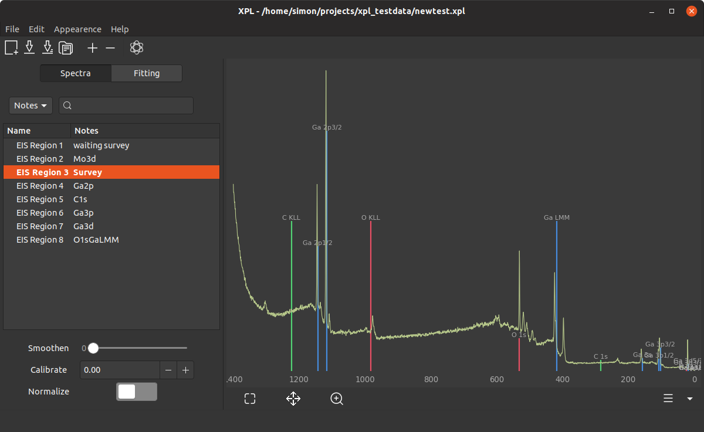
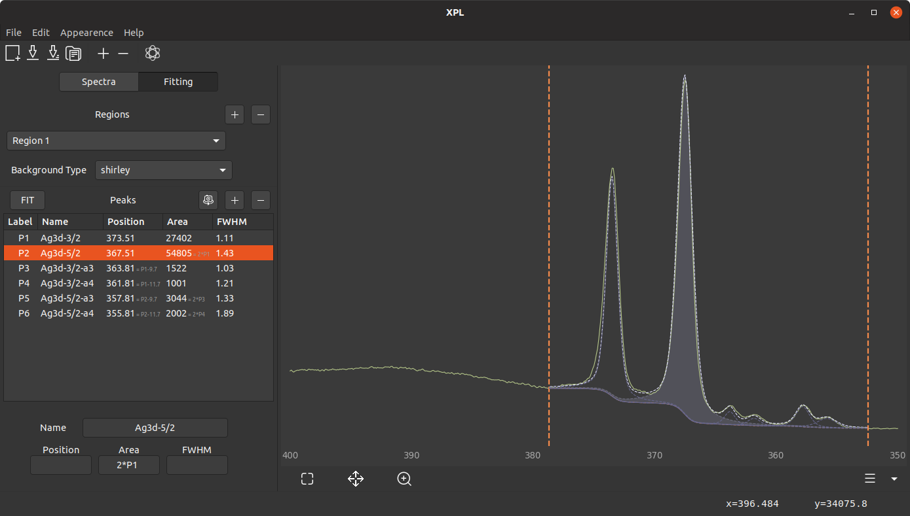

# XPL

XPL is a tool for plotting and analyzing X-ray photoelectron spectroscopy (XPS) data. It can fit peaks using Pseudo Voigt profiles (more models to come) while enabling Area, Position and FWHM restrainment of the individual peaks to physically sensible values (or expressions).


## Installation
### Ubuntu

If you don't already have it installed, install python and pip as well as libffi6 and python-gi through apt. Python version needs to be `>=3.5` (not tested below) and GTK needs to be version `>=3.14`.

```shell
$ sudo apt install python3 pip3
$ sudo apt install libffi6 python3-gi
$ pip3 install xpl
```

On starting, XPL creates a `~/.config/xpl` folder where configuration files and converted spectrum files will be stored. To **launch** xpl, just select it from your applications menu. Alternatively, run it as a module:

```shell
$ python3 -m xpl
```

To **update** xpl, run

```shell
$ pip3 install --upgrade xpl
```

### Windows

I have not yet succeeded in building a windows `.exe` style app or even an installer. However, you can try to install PyGObject manually and get the xpl package through pip.

First, you need Python 3.5 (other 3.x will probably work, not tested) from https://www.python.org/downloads/windows/ or Anaconda or whatever. Then, you need PyGObject eiter from https://sourceforge.net/projects/pygobjectwin32/ or through MSYS (http://www.msys2.org). I could not get it to work.

<!---
Download the x86_64 installer from http://www.msys2.org/. The instructions are shown on the website, here it is in short form: Follow the installer, then in the MSYS console type `pacman -Syu` and `pacman -Su`. If you encounter a warning, just close the MSYS console and try again.

In the MSYS console, run

```
pacman -S mingw-w64-i686-gtk3 mingw-w64-i686-python3-gobject
```
--->

## Usage

You can import spectra by clicking the plus icon in the main toolbar. So far, only exportet `.txt` files from the EIS Omicron software can be parsed.

When the "Spectra" tab is selected, you can choose the spectra to view by selecting them, right clicking and clicking "Plot selected spectra". The rightmost icon in the top toolbar lets you select elements whose peak positions should be displayed (see screenshot).



In the fitting tab, you can first add one or more regions by clicking "+" next to "Regions", then dragging across the Plot View. 

When a region is selected, you can add peaks by clicking "+" next to "Peaks" and drawing them by dragging from the peak maximum downwards inside the selected region. After this, you can constrain the peak values in the bottommost three entries: They accept input either like `< min > max` where `min` and `max` are minimum and maximum values for the corresponding parameter, or like `expression` which can be a simple arithmetic expression or just a fixed value. A relation to the same parameter of another peak can be expressed by using their label (see screenshot below).



Exporting the data or the plot is not yet supported.

## Building
### PyPI

Run this for building the pypi package and uploading it.

```shell
python3 setup.py sdist bdist_wheel
python3 -m twine upload dist/xpl-VERSION*
```

Note to self: Don't forget to use the correct version name when uploading to pypi.

### Executable for Linux

Just run

```shell
pyinstaller xpl_linux.spec
```

This makes an executable `dist/xpl/XPL`. For now, this still produces a Gtk-Warning about libcanberra when running the app but that can probably safely be ignored.