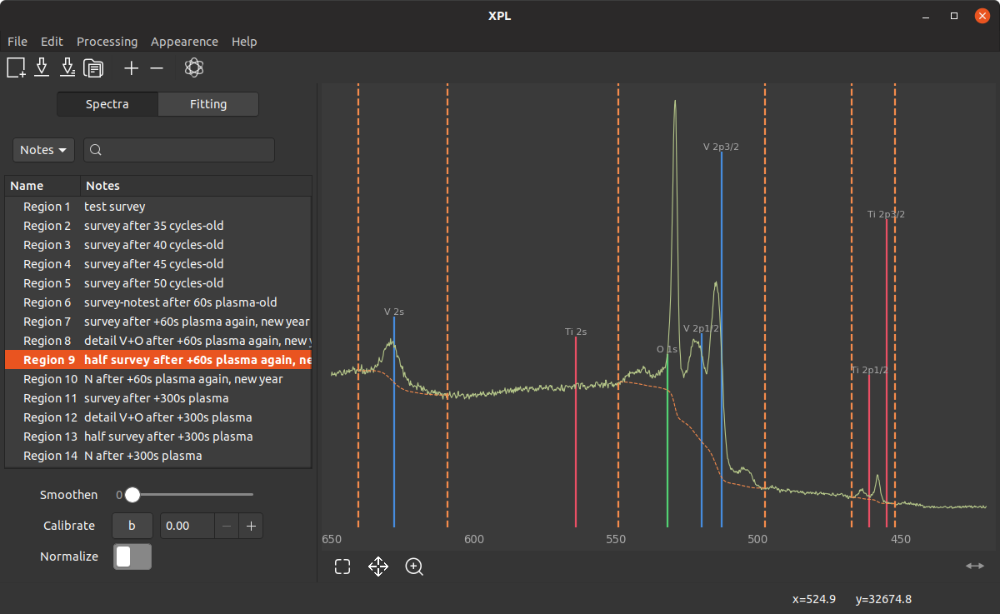

# XPL




## Installation
### Ubuntu
Install libffi and python-gi through apt (also, if you should not already have it, install python and git). After that, install the python module requirements.

```shell
$ sudo apt install python3 pip3 git
$ sudo apt install libffi6 python3-gi
$ pip3 install numpy matplotlib cairocffi lmfit
```

Clone the github repo and make `main.py` executable.

```shell
$ git clone https://github.com/schachmett/xpl
$ cd xpl
$ sudo chmod +x main.py
```


## Starting

Just run `main.py`. On starting, XPL creates a `~/.xpl` folder where configuration files and converted spectrum files will be stored.

```shell
./main.py
```